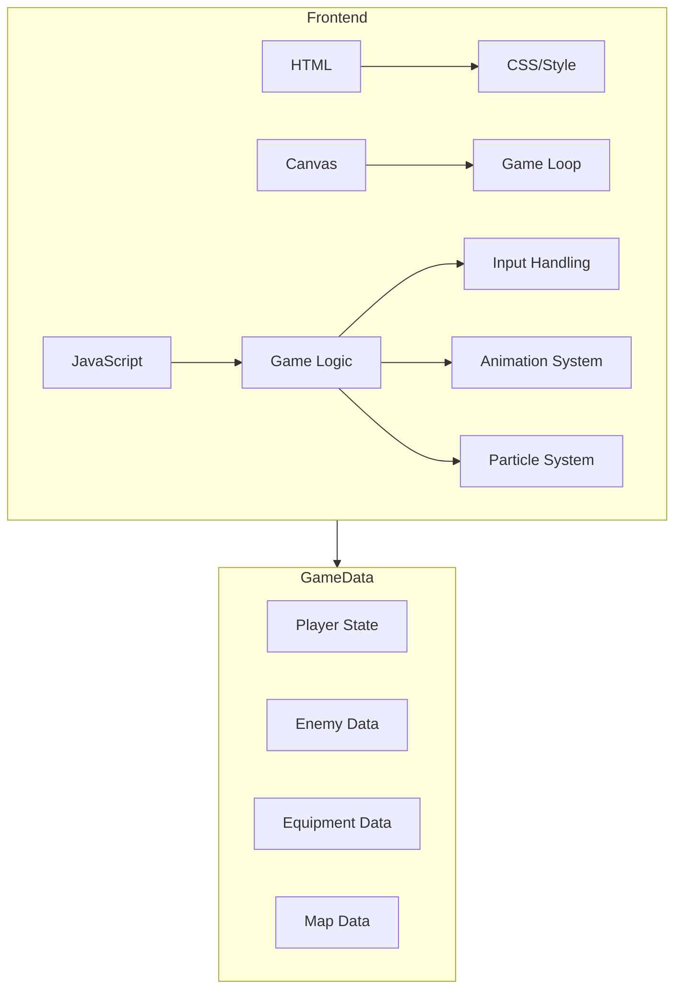

## 1. Architecture Design


## 2. Technology Description
- **Frontend**: 原生 HTML5 + JavaScript + CSS3
- **Canvas**: HTML5 Canvas 2D 渲染
- **Animation**: 基于帧的动画系统，使用 requestAnimationFrame
- **No Backend**: 纯前端游戏，数据存储在内存中

## 3. Route Definitions
| Route | Purpose |
|-------|---------|
| / | 游戏主页面 |

## 4. API Definitions
无需后端 API，纯前端游戏。

## 5. 核心模块设计

### 5.1 游戏循环
- **输入处理**：键盘事件监听，状态追踪
- **更新逻辑**：角色、敌人、相机、粒子更新
- **渲染**：地图、角色、敌人、掉落、特效渲染

### 5.2 动画系统
- **SpriteAnimation**：帧动画管理器
- **AnimationFrame**：单帧数据
- **动画状态**：idle, walk, attack, skill, hit, die

### 5.3 粒子系统
- **ParticleEmitter**：粒子发射器
- **Particle**：单个粒子数据
- **特效类型**：hit, levelUp, drop, skill, transform

### 5.4 数据结构
```typescript
interface Player {
    x: number;
    y: number;
    width: number;
    height: number;
    hp: number;
    maxHp: number;
    mp: number;
    maxMp: number;
    level: number;
    exp: number;
    expToLevel: number;
    gold: number;
    attack: number;
    defense: number;
    equipment: {
        weapon: Equipment | null;
        armor: Equipment | null;
        accessory: Equipment | null;
    };
    animation: SpriteAnimation;
}

interface Enemy {
    x: number;
    y: number;
    hp: number;
    maxHp: number;
    type: string;
    attack: number;
    animation: SpriteAnimation;
}

interface Equipment {
    name: string;
    emoji: string;
    type: 'weapon' | 'armor' | 'accessory';
    stats: {
        attack?: number;
        defense?: number;
        crit?: number;
    };
}
```

## 6. 地图系统
### 6.1 地图数据
```typescript
interface MapData {
    name: string;
    tiles: number[][];
    enemies: EnemySpawn[];
    bgColor: string;
    groundColor: string;
    minLevel: number;
}
```

### 6.2 瓦片类型
- 0: 地面（可行走）
- 1: 墙壁（不可行走）
- 2: 装饰
