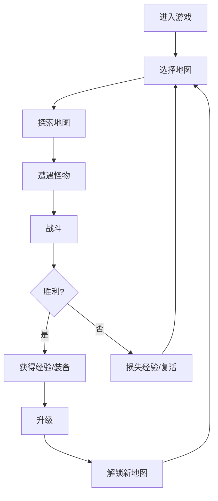

## 1. Product Overview
二郎神RPG游戏 - 一款动作角色扮演游戏，以中国神话人物二郎神为主角，包含完整的战斗、升级、多地图探索和装备系统。
- 目标用户：喜欢中国神话和RPG游戏的玩家
- 产品价值：提供沉浸式的二郎神冒险体验，包含丰富的技能和装备系统

## 2. Core Features

### 2.1 User Roles
无需用户角色区分，单一玩家角色。

### 2.2 Feature Module
1. **游戏主界面**：地图探索、角色状态、技能栏、装备栏
2. **战斗系统**：即时战斗、技能释放、怪物AI
3. **地图系统**：多地图切换、地图选择界面
4. **升级系统**：经验获取、等级提升、属性增强
5. **装备系统**：装备掉落、装备替换、属性加成

### 2.3 Page Details
| Page Name | Module Name | Feature description |
|-----------|-------------|---------------------|
| 游戏主界面 | 游戏画布 | 显示游戏地图、角色、怪物、掉落物 |
| 游戏主界面 | 状态栏 | 显示生命值、魔法值、等级、金币 |
| 游戏主界面 | 技能栏 | 显示可用技能、冷却时间、快捷键提示 |
| 游戏主界面 | 装备栏 | 显示当前装备的武器、防具、饰品 |
| 地图选择 | 地图列表 | 显示可用地图、等级要求、地图预览 |

## 3. Core Process
玩家进入游戏 → 选择地图 → 探索地图 → 战斗怪物 → 获取经验和装备 → 升级角色 → 解锁新地图 → 重复循环

## 4. User Interface Design
### 4.1 Design Style
- **主色调**：金色 (#FFD700)、深红色 (#8B0000)、黑色 (#1a1a2e)
- **副色调**：橙色 (#FF8C00)、银色 (#C0C0C0)、绿色 (#00FF00)
- **按钮风格**：3D效果、金色边框、悬停发光
- **字体**：Press Start 2P（标题）、Arial（正文）
- **布局风格**：游戏画面居中，UI元素环绕布局
- **图标风格**：符合中国神话的emoji和手绘风格

### 4.2 Page Design Overview
| Page Name | Module Name | UI Elements |
|-----------|-------------|-------------|
| 游戏主界面 | 游戏画布 | 复古像素风格地图、精致的二郎神角色、流畅的动画效果 |
| 游戏主界面 | 状态栏 | 红色血条、蓝色魔法条、金色等级徽章、金色金币显示 |
| 游戏主界面 | 技能栏 | 技能图标、冷却倒计时、金色边框、发光特效 |
| 游戏主界面 | 装备栏 | 装备图标、金色边框、悬浮提示 |
| 地图选择 | 地图列表 | 金色边框卡片、地图emoji预览、等级要求标签 |

### 4.3 Responsiveness
- 桌面优先设计，固定分辨率游戏画布
- UI元素自适应布局
- 键盘操作优化

### 4.4 动画设计
- **角色行走动画**：4帧循环，身体微动、脚步交替
- **角色攻击动画**：武器挥舞、身体前冲、攻击特效
- **技能释放动画**：天眼激光、变身效果、哮天犬召唤
- **怪物动画**：怪物行走、攻击、受击、死亡
- **特效动画**：命中、升级、掉落、技能特效
